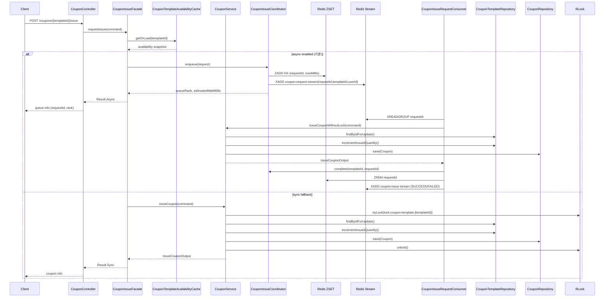

# 쿠폰 발급 로직 & 순서 보장 분석

## 1. 전체 처리 흐름
- **Controller → Facade**: `CouponController.issueCoupon`은 HTTP 요청을 `CouponService.IssueCouponCommand`로 묶어 `CouponIssueFacade.requestIssue`에 위임한다. Facade는 사용자/템플릿을 사전 검증하고 동기/비동기 모드를 결정한다 (`coupon-service/.../presentation/CouponController.kt:24-80`, `coupon-service/.../application/issue/CouponIssueFacade.kt:21-48`).
- **동기(폴백) 경로**: 비동기 기능을 끄거나 Redis 큐 사용이 불가능한 상황이면 `CouponIssueFacade`가 `CouponService.issueCoupon`을 바로 호출한다. 서비스는 분산락+DB 락 안에서 재고 차감/발급을 끝낸 뒤 응답을 바로 돌려준다 (`coupon-service/.../application/CouponService.kt:27-89`).
- **비동기 경로**: 기본값은 Redis 큐 기반이다. Facade는 `CouponIssueCoordinator.enqueue`를 호출해 (1) 템플릿별 ZSET 대기열에 요청 순서를 기록하고 (2) Redis Stream에 발급 요청 이벤트를 집어넣는다. 응답은 `queueRank/estimatedWaitMillis`만 포함한다 (`coupon-service/.../application/issue/CouponIssueCoordinator.kt:31-63`).
- **워커 소비**: `CouponIssueRequestConsumer`가 Stream Consumer Group으로 `coupon:request-stream`을 읽어 단일 워커 스레드에서 처리한 뒤 결과를 `coupon:issue-stream`에 적재한다. 처리가 끝나면 같은 Coordinator의 `complete`를 호출해 대기열(ZSET)에서 제거, `ack`로 스트림 메시지를 확인한다 (`coupon-service/.../infrastructure/redis/CouponIssueRequestConsumer.kt:24-158`).

## 2. 분산락 적용 위치와 의미
- **공통 구성**: `@DistributedLock` 애노테이션과 `DistributedLockAspect`가 `RedissonClient`를 사용해 `lock:coupon-template:{templateId}` 키 기반 `RLock`을 획득한다. SpEL 키는 조인포인트 파라미터에서 계산하고, `tryLock(waitTime=2s, leaseTime=5s)`로 선착순 경쟁을 완화한다 (`common/.../DistributedLock.kt`, `common/.../DistributedLockAspect.kt:24-69`).
- **도메인 서비스 보호**: `CouponService.issueCoupon` 메서드에만 애노테이션을 붙여 템플릿 단위 임계 영역을 만든다 (`coupon-service/.../application/CouponService.kt:27-44`). 락을 잡은 상태에서 DB 비관적 락(`findByIdForUpdate`)으로 템플릿 레코드를 잠그고, 사용자별 보유 쿠폰을 검사한 뒤 `incrementIssuedQuantity`를 실행한다 (`coupon-service/.../infrastructure/CouponTemplateRepository.kt:14-34`). 이렇게 **Redis 분산락 + DB row 락**의 이중 잠금으로 다중 인스턴스/다중 스레드 환경에서도 초과 발급을 막는다.
- **워커 경로에서는 생략**: Stream 워커는 `couponService.issueCouponWithoutLock`을 호출한다 (`coupon-service/.../infrastructure/redis/CouponIssueRequestConsumer.kt:97-105`). 워커는 단일 Consumer 인스턴스에서 순차로 실행되고, 내부적으로 여전히 DB 비관적 락을 잡기 때문에 별도의 Redis 락이 없어도 데이터 일관성이 유지된다. 큐/스트림으로 API 트래픽을 직렬화했기 때문에 분산락 대기 시간이 전체 응답을 막지 않는다.

## 3. 대기열 & 순서 보장 메커니즘
- **Sorted Set 기반 대기열**: `CouponIssueCoordinator.enqueue`가 `queueKey=coupon:queue-position:{templateId}`에 `ZADD NX requestId score=nowMillis`로 요청을 넣는다 (`coupon-service/.../application/issue/CouponIssueCoordinator.kt:31-55`). `requestId`는 `{templateId}:{userId}` 형태라 동일 사용자의 중복 요청은 ZSET에서 무시되어 자연스럽게 초기 요청 순서가 유지된다.
- **순번 계산 & 만료**: `queueOps.rank`로 현재 순번을 계산하고, 평균 처리 시간(`average-processing-millis` 프로퍼티)과 곱해 예상 대기 시간을 추정한다. 큐 키에는 TTL(기본 1일)을 걸어 이벤트 종료 후 자동 정리된다 (`coupon-service/.../application/issue/CouponIssueCoordinator.kt:31-63, 86-94`).
- **Stream을 통한 처리 순서**: `enqueue`에 성공한 요청만 `coupon:request-stream`에 `XADD`된다. Redis Stream은 append-only 구조이며 Consumer Group(`coupon-issue-group`)이 하나의 워커 ID로 `ReadOffset.lastConsumed()`부터 순서대로 읽는다. Spring의 `StreamMessageListenerContainer`가 단일 스레드 콜백을 보장하므로 **Stream 삽입 순서 = 워커 처리 순서**가 된다 (`coupon-service/.../infrastructure/redis/CouponIssueRequestConsumer.kt:52-129`).
- **정리 & 재처리**: 워커가 처리 결과를 `coupon:issue-stream`에 기록한 뒤 `couponIssueCoordinator.complete`로 ZSET에서 요청 ID를 제거하므로, 남아있는 ZSET 순번은 “아직 처리되지 않은 사람들”만 의미한다 (`coupon-service/.../application/issue/CouponIssueCoordinator.kt:65-67`). 워커 예외 시에도 `finally` 블록에서 `complete + ack`를 수행해 대기열 꼬임을 방지하고, Stream Consumer Group의 Pending Entries가 있으므로 재시도/보정 여지도 있다.

## 4. 추가 관찰 포인트
- **캐시 & 사전 검증**: Facade는 Redis Hash 기반의 `CouponTemplateAvailabilityCache`에서 템플릿 스냅샷을 읽어 즉시 발급 가능 여부를 판단한다. TTL(기본 30초) 안에서 `incrementIssuedQuantity` 호출 시 캐시도 함께 증가시켜 API 측 예측치와 실제 재고의 차이를 줄인다 (`coupon-service/.../infrastructure/redis/CouponTemplateAvailabilityCache.kt:18-87`).
- **DB 일관성**: 최종 재고 차감은 `CouponTemplateRepository.incrementIssuedQuantity`와 `CouponTemplate.issue()` 호출을 통해 RDB에 반영한다 (`coupon-service/.../application/CouponService.kt:64-74`). 실패 시 예외를 던져 워커가 Stream에 실패 이벤트를 기록하고 대기열에서 제거하여 순번 누락을 막는다.
- **결과 통지 채널**: 현재는 `coupon:issue-stream`에 성공/실패 정보만 적재하고 있지만 (`coupon-service/.../infrastructure/redis/CouponIssueRequestConsumer.kt:104-147`), 동일 스트림을 구독하는 별도 컨슈머를 붙이면 SSE/Push 알림이나 후속 배치를 구성할 수 있다.

요약하면, **동기 경로**는 Redisson 분산락 + DB 비관적 락으로 즉시 발급을 안전하게 처리하고, **비동기 경로**는 “ZSET 순번 → Stream 직렬화 → 단일 워커 소비” 조합으로 순서를 보장한다. 대기열 TTL/`complete` 호출 덕분에 오래된 레코드가 남지 않으며, Stream Consumer Group이 장애 시에도 순서 유지를 지원한다.

## 5. Sequence Diagram

