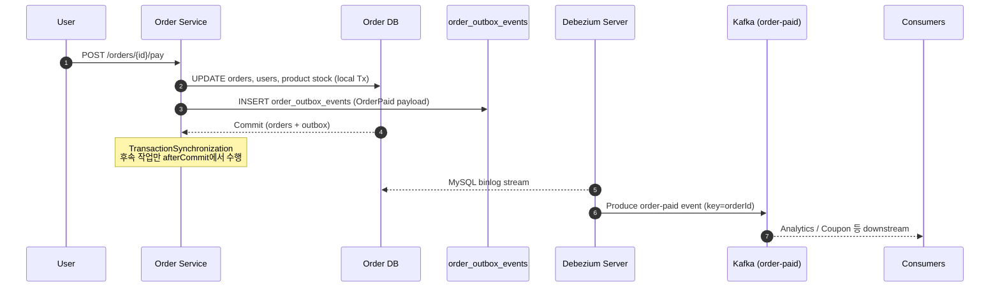

# Order Service CDC & Outbox 설계

## 1. 배경
- 결제 트랜잭션과 이벤트 발행 간의 간극 때문에 Kafka 발행 실패 시 정합성이 깨질 수 있었다.
- 주문 서비스 DB에 Outbox 테이블(`order_outbox_events`)을 두고 동일 트랜잭션 내에서 이벤트를 적재한 뒤 CDC(Debezium)로 Kafka에 전달해 **At-least-once** 를 보장한다.

## 2. 비즈니스 시퀀스


### 세부 단계
1. `OrderService.processPayment`는 결제/잔액/쿠폰 처리 후 `OrderOutboxService.enqueueOrderPaid`를 호출한다.
2. `OrderOutboxEvent` 엔터티는 JSON payload, status, retryCount 등을 저장하며 PK는 Snowflake ID.
3. 트랜잭션 커밋 이후 `OrderDataTransmissionService`가 집계 시스템으로 데이터를 전송하되 이벤트 발행은 Outbox가 담당한다.
4. Debezium Server는 order DB binlog를 구독하고 `EventRouter` SMT로 event_type별 Kafka 토픽(`order-paid`)으로 라우팅한다.

## 3. 카프카 & CDC 구성
### 3.1 MySQL 설정 (`docker-compose.yml`)
- Binlog: `--log-bin=mysql-bin`, `--binlog_format=ROW`, `--binlog_row_image=FULL`.
- GTID: `--gtid_mode=ON`, `--enforce_gtid_consistency=ON` (재처리 안정성).
- 데이터 보존: `--binlog_expire_logs_seconds=86400`.

### 3.2 Debezium Server (`docker/debezium/application.properties`)
| 설정 | 값 | 설명 |
| --- | --- | --- |
| `debezium.source.database.*` | `order-mysql`, `debezium/debezium` | CDC 대상 DB 및 계정 |
| `debezium.source.table.include.list` | `order_service.order_outbox_events` | Outbox 테이블만 스트리밍 |
| `debezium.transforms` | `outbox` | Debezium Outbox SMT 활성화 |
| `...route.topic.replacement` | `${routedByValue}` | `event_type`값을 Kafka 토픽명으로 사용 (`order-paid`) |
| `sink.type` | `kafka` | Kafka broker(`kafka:29092`)로 전송 |

### 3.3 Kafka 토픽 전략
| 항목 | 값 |
| --- | --- |
| 토픽명 | `order-paid` |
| Key | `aggregate_id` (orderId) |
| Value | Outbox payload(JSON) |
| Partitioning | orderId 기반 해시 → 같은 주문 이벤트 순서 보장 |
| Consumer 예시 | 랭킹 집계, 외부 데이터 플랫폼, 쿠폰 서비스 |

## 4. 데이터 모델
```text
order_outbox_events
├─ id BIGINT PK (Snowflake)
├─ aggregate_type VARCHAR(64) = "order"
├─ aggregate_id VARCHAR(191)
├─ event_type VARCHAR(128) = "order-paid"
├─ payload LONGTEXT (OrderPaidEvent JSON)
├─ occurred_at DATETIME(6)
├─ status ENUM(PENDING, PUBLISHED, FAILED)
├─ retry_count INT, last_error TEXT
├─ created_at / published_at DATETIME(6)
```
- 하위 시스템은 Debezium이 생성한 Kafka 메시지 헤더(`eventStatus`, timestamp 등)를 사용해 상태 추적 가능.
- `V1__init_schema.sql`, `V2__seed_data.sql`에 DDL/DML을 반영해 테스트 및 운영 DB가 동일 구조를 갖도록 했다.

## 5. 운영 가이드
1. **컨테이너 기동**
   ```bash
   docker compose up -d order-mysql kafka order-debezium kafka-ui
   ```
2. **Kafka UI(8088)**에서 `order-paid` 토픽 확인 → 이벤트 수신 여부 체크.
3. Debezium 로그(`docker logs joopang-order-debezium`)에서 snapshot 상태 및 오류를 모니터링.
4. 장애 시 재처리 전략
   - Debezium sink 장애: 컨테이너 재기동 시 binlog offset부터 재시작 → Outbox 레코드 재전송.
   - 다운스트림 장애: Kafka consumer에서 재시도/Dead-letter queue 구성.
5. 보안/운영
   - 실제 환경에서는 Debezium 계정 비밀번호와 Kafka 인증(SASL/SSL)을 외부 비밀 저장소로 분리.
   - Binlog 보존 시간은 소비 지연 대비 충분히 크게 설정하고, CDC 지연 시 알람을 추가한다.

## 6. 영향 범위 & TODO
- `OrderEventPublisher` 삭제 → 기존 직접 Kafka 발행 경로 제거.
- 애플리케이션에서 Outbox 조회/재처리 API가 필요하면 Admin Endpoint를 별도로 추가 예정.
- 향후 쿠폰 서비스 등 다른 도메인에서도 동일 패턴을 재사용할 수 있도록 Outbox 모듈을 추상화한다.
