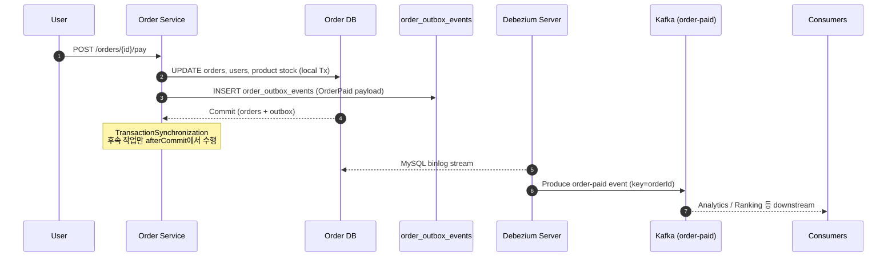
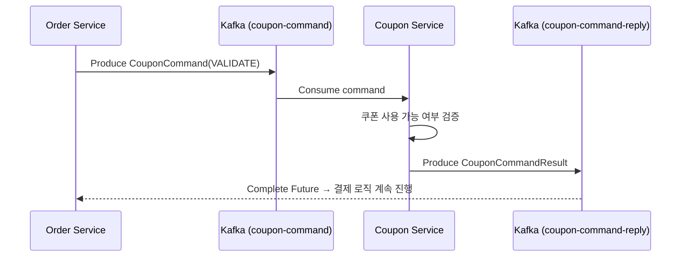
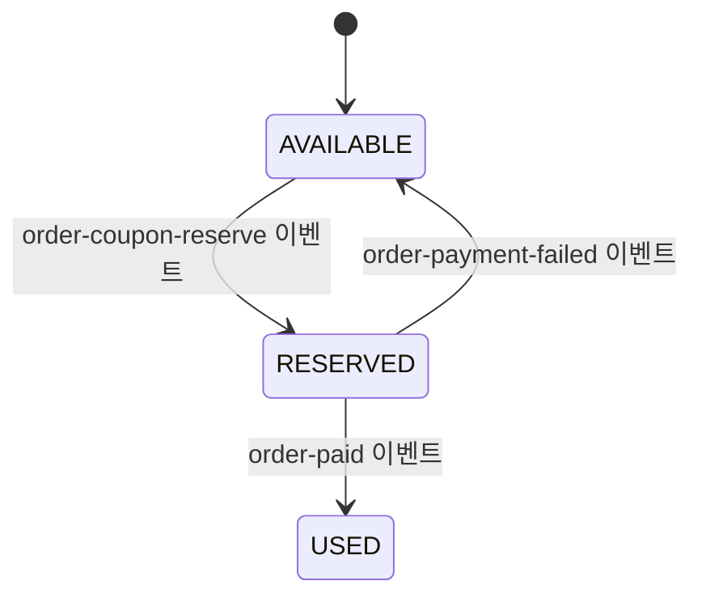

# Order Service CDC & Outbox 설계

## 1. 배경
- **기존 구조**: 주문 서비스가 쿠폰 서비스 REST API를 동기 호출해 검증/차감을 수행했고, 주문 결제 이벤트도 동일 애플리케이션에서 직접 Kafka에 발행했다. 결제 트랜잭션 > 쿠폰 API > Kafka 발행 순으로 이어지다 보니 한 단계라도 지연/실패하면 전체 트랜잭션이 실패하거나 장애 전파(쿠폰 장애 → 주문 결제 장애)가 발생했다.
- **개선 목표/결과**: 주문/쿠폰 간 결합을 끊고, 결제 트랜잭션과 이벤트 발행 사이의 간극을 제거한다. 주문 서비스는 Outbox 테이블(`order_outbox_events`)을 동일 트랜잭션으로 기록하고 CDC(Debezium)로 `order-paid` 이벤트를 Kafka에 전달해 **At-least-once** 를 보장한다. 쿠폰 검증은 여전히 Kafka `coupon-command`/`coupon-command-reply` 기반 요청-응답으로 수행하되, 쿠폰 사용 확정은 `order-paid` 이벤트를 구독하는 쿠폰 서비스(`CouponUsageService`)가 비동기 처리한다.

## 2. 비즈니스 시퀀스


### 세부 단계
1. `OrderService.processPayment`는 결제/잔액/쿠폰 처리 후 `OrderOutboxService.enqueueOrderPaid`를 호출한다.
2. `OrderOutboxEvent` 엔터티는 JSON payload, status, retryCount 등을 저장하며 PK는 Snowflake ID.
3. 트랜잭션 커밋 이후 `OrderDataTransmissionService`가 집계 시스템으로 데이터를 전송하되 이벤트 발행은 Outbox가 담당한다.
4. Debezium Server는 order DB binlog를 구독하고 `EventRouter` SMT로 event_type별 Kafka 토픽(`order-paid`)으로 라우팅한다.

### 쿠폰 서비스 연동 분리
- 주문 서비스는 쿠폰 도메인 로직을 직접 호출하지 않고 `CouponClient` 인터페이스를 통해 검증만 위임한다. 운영 프로파일에서는 `KafkaCouponClient`(`order-service/src/main/kotlin/io/joopang/services/order/application/coupon/KafkaCouponClient.kt`)가 `CouponCommand` 메시지를 Kafka에 발행하고, 응답 `CouponCommandResult`를 Future로 받아 처리한다.
- 사용 토픽: `coupon-command`(요청), `coupon-command-reply`(응답). 이름은 `order-service/src/main/resources/application.yml`의 `kafka.topics.*`로 설정하며, 기본값은 각각 `coupon-command`, `coupon-command-reply`다.
- 쿠폰 서비스 쪽에서는 `CouponCommandHandler`(`coupon-service/src/main/kotlin/io/joopang/services/coupon/application/CouponCommandHandler.kt`)가 `coupon-command` 토픽을 소비해 `CouponOrderFacade`로 검증 트랜잭션을 수행한 뒤, 결과를 `coupon-command-reply`로 돌려준다. 양쪽 모두 `common` 모듈의 `coupon.contract` DTO를 공유해 스키마를 동기화한다.
- 쿠폰 사용 확정은 CDC Outbox에서 발생한 `order-paid` 이벤트를 별도 리스너(`coupon-service/.../OrderPaidEventListener.kt`)가 구독해 처리한다. 이로써 주문 결제 트랜잭션이 쿠폰 서비스 DB와 직접 결합하지 않는다.

#### 쿠폰 명령 플로우


#### 쿠폰 사용 이벤트 처리
- `OrderService`는 결제 완료 시 사용하는 쿠폰 ID 목록을 `OrderPaidEvent.couponIds`에 포함해 Outbox에 적재한다.
- 쿠폰 서비스는 `OrderPaidEventListener`(`coupon-service/src/main/kotlin/io/joopang/services/coupon/application/OrderPaidEventListener.kt`)로 `order-paid` 토픽을 구독하고, `CouponUsageService`가 `findByIdForUpdate` + `Coupon.markUsed` 로 최종 상태를 갱신한다. 이미 처리된 주문 ID나 다른 사용자 ID일 경우 idempotent하게 무시한다.
- 향후 `RESERVED` 상태를 도입해 예약/실패 복구까지 확장할 수 있도록 상태 전이 다이어그램을 기준으로 운영한다.



- 현재 구현은 `order-paid` 이벤트에서 직접 `USED` 상태로 전환하며, 추후 `order-coupon-reserve`/`order-payment-failed` 이벤트를 추가하면 동일 Outbox 패턴으로 상태 확장 가능하다.

## 3. 카프카 & CDC 구성
### 3.1 MySQL 설정 (`docker-compose.yml`)
- Binlog: `--log-bin=mysql-bin`, `--binlog_format=ROW`, `--binlog_row_image=FULL`.
- GTID: `--gtid_mode=ON`, `--enforce_gtid_consistency=ON` (재처리 안정성).
- 데이터 보존: `--binlog_expire_logs_seconds=86400`.

### 3.2 Debezium Server (`docker/debezium/application.properties`)
| 설정 | 값 | 설명 |
| --- | --- | --- |
| `debezium.source.database.*` | `order-mysql`, `debezium/debezium` | CDC 대상 DB 및 계정 |
| `debezium.source.table.include.list` | `order_service.order_outbox_events` | Outbox 테이블만 스트리밍 |
| `debezium.transforms` | `outbox` | Debezium Outbox SMT 활성화 |
| `...route.topic.replacement` | `${routedByValue}` | `event_type`값을 Kafka 토픽명으로 사용 (`order-paid`) |
| `sink.type` | `kafka` | Kafka broker(`kafka:29092`)로 전송 |

### 3.3 Kafka 토픽 전략
| 항목 | 값 |
| --- | --- |
| 토픽명 | `order-paid` |
| Key | `aggregate_id` (orderId) |
| Value | Outbox payload(JSON) |
| Partitioning | orderId 기반 해시 → 같은 주문 이벤트 순서 보장 |
| Consumer 예시 | 랭킹 집계(`OrderDataTransmissionService`), 쿠폰 사용(`CouponUsageService`), 외부 데이터 플랫폼 |

## 4. 데이터 모델
```text
order_outbox_events
├─ id BIGINT PK (Snowflake)
├─ aggregate_type VARCHAR(64) = "order"
├─ aggregate_id VARCHAR(191)
├─ event_type VARCHAR(128) = "order-paid"
├─ payload LONGTEXT (OrderPaidEvent JSON)
├─ occurred_at DATETIME(6)
├─ status ENUM(PENDING, PUBLISHED, FAILED)
├─ retry_count INT, last_error TEXT
├─ created_at / published_at DATETIME(6)
```
- 하위 시스템은 Debezium이 생성한 Kafka 메시지 헤더(`eventStatus`, timestamp 등)를 사용해 상태 추적 가능.
- `V1__init_schema.sql`, `V2__seed_data.sql`에 DDL/DML을 반영해 테스트 및 운영 DB가 동일 구조를 갖도록 했다.

## 5. 운영 가이드
1. **컨테이너 기동**
   ```bash
   docker compose up -d order-mysql kafka order-debezium kafka-ui
   ```
2. **Kafka UI(8088)**에서 `order-paid` 토픽 확인 → 이벤트 수신 여부 체크.
3. Debezium 로그(`docker logs joopang-order-debezium`)에서 snapshot 상태 및 오류를 모니터링.
4. 장애 시 재처리 전략
   - Debezium sink 장애: 컨테이너 재기동 시 binlog offset부터 재시작 → Outbox 레코드 재전송.
   - 다운스트림 장애: Kafka consumer에서 재시도/Dead-letter queue 구성.
5. 보안/운영
   - 실제 환경에서는 Debezium 계정 비밀번호와 Kafka 인증(SASL/SSL)을 외부 비밀 저장소로 분리.
   - Binlog 보존 시간은 소비 지연 대비 충분히 크게 설정하고, CDC 지연 시 알람을 추가한다.

## 6. 영향 범위 & TODO
- `OrderEventPublisher` 삭제 → 기존 직접 Kafka 발행 경로 제거.
- 애플리케이션에서 Outbox 조회/재처리 API가 필요하면 Admin Endpoint를 별도로 추가 예정.
- 향후 쿠폰 서비스 등 다른 도메인에서도 동일 패턴을 재사용할 수 있도록 Outbox 모듈을 추상화한다.
- `order-paid`/`coupon-command` 컨슈머 장애 시 이벤트가 유실되지 않도록 DLQ 플러그인(예: Kafka DLQ 토픽 + 재처리 워커)을 도입한다. 컨슈머가 오류를 던지면 `order-paid-dlq`, `coupon-command-dlq` 등의 토픽으로 라우팅하고, DLQ 모니터가 Slack/알람으로 통지 후 재처리 작업을 실행하는 흐름을 정의한다. 이벤트 스키마와 idempotency 키(`orderId`, `couponId`)를 활용해 DLQ 재처리 시 중복 적용을 방지한다.


INSERT INTO order_outbox_events (
      id,
      aggregate_type,
      aggregate_id,
      event_type,
      payload,
      occurred_at,
      status,
      created_at,
      retry_count
  ) VALUES (
      1,
      'order',
      'order-20241218-0001',
      'order-paid',
      '{
          "orderId": "order-20241218-0001",
          "userId": "user-42",
          "totalAmount": 45000,
          "paidAt": "2025-12-18T04:46:00Z"
      }',
      NOW(6),
      'PENDING',
      NOW(6),
      0
  );
