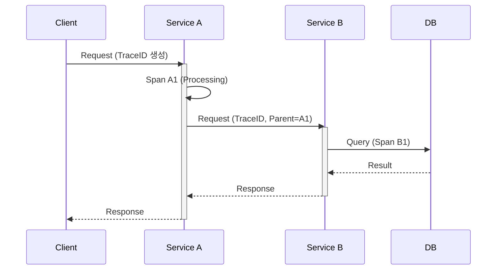

# 🕵️ APM 도구와 분산 추적 (APM Tools & Distributed Tracing)

## 1. APM (Application Performance Monitoring)이란?

### 1.1 정의

APM은 **Application Performance Monitoring** (또는 Management)의 약자로, 애플리케이션의 성능과 가용성을 모니터링하고 관리하는 시스템을 말합니다.

### 1.2 주요 목적

- **성능 모니터링**: 응답 시간, 처리량(Throughput), 에러율 등을 실시간으로 감시합니다.
- **문제 진단**: 시스템 지연이나 장애 발생 시 근본 원인(Root Cause)을 빠르게 파악합니다.
- **사용자 경험 개선**: 최종 사용자가 겪는 지연 시간을 최소화하여 서비스 만족도를 높입니다.
- **리소스 최적화**: CPU, 메모리 등 시스템 리소스 사용량을 분석하여 효율적으로 관리합니다.

---
| 도구                       | 분류(포지션)                                       | 주로 다루는 데이터                    | 핵심 역할(한 줄 요약)                                  | OpenTelemetry와 관계(겹침 여부)                                 |
| ------------------------ | --------------------------------------------- | ----------------------------- | ---------------------------------------------- | -------------------------------------------------------- |
| **OpenTelemetry (OTel)** | **표준/수집 파이프라인** (Instrumentation + Collector) | Trace / Metric / Log          | 앱에서 관측 데이터를 만들고(계측) 모아서(Collector) 백엔드로 보내는 표준 | ✅ 기준점(OTel이 중심). UI/저장소는 아님                              |
| **Grafana Tempo**        | **Trace 저장소(Backend)**                        | Trace                         | 분산 추적 데이터를 저장하고 조회 API 제공                      | ❌ 겹치지 않음. **OTel이 보낸 Trace를 저장**                         |
| **Prometheus**           | **Metric 저장소(Backend)**                       | Metric                        | 시계열 메트릭 저장/쿼리                                  | ❌ 겹치지 않음. **OTel이 보낸/노출한 Metric을 저장**                    |
| **Grafana Loki**         | **Log 저장소(Backend)**                          | Log                           | 로그 저장/검색                                       | ❌ 겹치지 않음. OTel로 로그 보내서 Loki에 저장 가능                       |
| **Grafana**              | **UI/시각화**                                    | Trace/Metric/Log (연결된 백엔드 기반) | Tempo/Prom/Loki 등 여러 데이터 소스를 통합 대시보드로 보여줌      | ❌ 겹치지 않음. OTel 결과를 “보는 화면”                               |
| **Elastic APM**          | **APM 제품(풀 패키지)**                             | Trace/Metric/Log + Error      | APM 수집+저장(Elasticsearch)+UI(Kibana)까지 한번에      | ⚠️ OTel과 일부 기능 겹칠 수 있음(수집/계측). 보통 **OTel→Elastic**로 많이 씀 |
| **Pinpoint**             | **APM 제품(풀 패키지, 오픈소스)**                       | Trace 중심 (+ Metric 일부)        | Agent/Collector/저장소/UI까지 자체 스택 제공 (서비스맵 강점)    | ⚠️ OTel과 일부 겹침(계측/수집). 대개 Pinpoint 단독 사용 많음              |
| **Jaeger**               | **Trace 저장소 + UI (트레이싱 제품)**                  | Trace                         | 트레이스 저장 및 조회 UI 제공(전통적인 트레이싱)                  | ❌ 겹치지 않음. OTel Trace 백엔드로 많이 사용                          |
| **Zipkin**               | **Trace 저장소 + UI (트레이싱 제품)**                  | Trace                         | 경량 트레이싱 백엔드/뷰어                                 | ❌ 겹치지 않음. OTel Trace를 Zipkin으로도 export 가능                |

---

## 2. 분산 추적 (Distributed Tracing)

### 2.1 개념

마이크로서비스 환경에서 하나의 사용자 요청이 여러 서비스를 거쳐 처리될 때, 전체 흐름을 추적하는 기술입니다.

### 2.2 작동 원리 (Trace Context Propagation)

요청이 서비스 간에 이동할 때 HTTP 헤더에 식별자를 포함시켜 전달합니다.

- **Trace ID**: 전체 트랜잭션을 식별하는 고유 ID.
- **Span ID**: 작업의 각 단위(구간)를 식별하는 ID.
- **Parent Span ID**: 호출 관계를 나타내는 ID.

---

## 3. Pinpoint (오픈소스 APM)

### 3.1 특징

- **Java 최적화**: Java 애플리케이션에 특화되어 있으며, Bytecode Instrumentation 기술을 사용하여 코드를 수정하지 않고 에이전트만 부착하면 됩니다.
- **Call Stack 시각화**: 메서드 레벨까지 상세한 호출 스택과 소요 시간을 보여줍니다.
- **Server Map**: 서비스 간의 연결 관계와 트래픽 흐름을 토폴로지 맵으로 시각화합니다.

### 3.2 아키텍처

- **Agent**: 애플리케이션에 부착되어 데이터 수집.
- **Collector**: 에이전트로부터 데이터를 수집하여 저장소에 저장.
- **HBase**: 대용량 트레이스 데이터를 저장하는 NoSQL DB.
- **Web**: 저장된 데이터를 시각화하여 보여주는 UI.

---

## 4. Datadog (SaaS APM)

### 4.1 특징

- **통합 관제**: 인프라, 애플리케이션, 로그, 네트워크, 보안 모니터링을 하나의 플랫폼에서 제공.
- **Tagging System**: `env:prod`, `service:payment` 등 태그 기반으로 데이터를 필터링하고 집계하는 기능이 강력함.
- **Watchdog**: 머신러닝 기반으로 이상 징후를 자동으로 탐지하고 알림을 보냄.

### 4.2 Pinpoint vs Datadog

| 특징 | Pinpoint | Datadog |
|------|----------|---------|
| **유형** | 오픈소스 (설치형) | SaaS (구독형) |
| **비용** | 무료 (인프라 운영 비용 발생) | 유료 (사용량 기반 과금) |
| **주 언어** | Java, PHP, Python 등 | 거의 모든 언어 지원 |
| **장점** | 상세한 Call Stack, 무료 | 설치 간편, 통합 UI, 알림/협업 기능 강력 |
| **단점** | 설치/운영 복잡, UI가 다소 투박 | 비용 부담, 데이터 외부 전송 이슈 |

---

## 5. 트레이싱 데이터 활용 예시

**문제 상황**: "결제 요청이 간헐적으로 3초 이상 걸린다."

1. **APM 접속**: 느린 트랜잭션 목록 조회.
2. **Trace 분석**: 3초 걸린 트랜잭션의 상세 Span 확인.
3. **병목 확인**:
    - Service A (10ms) -> Service B (2900ms) -> DB (50ms)
    - Service B 내부에서 외부 API 호출 구간이 2.8초 소요됨을 발견.
4. **조치**: 외부 API 타임아웃 설정 및 서킷 브레이커 적용.
