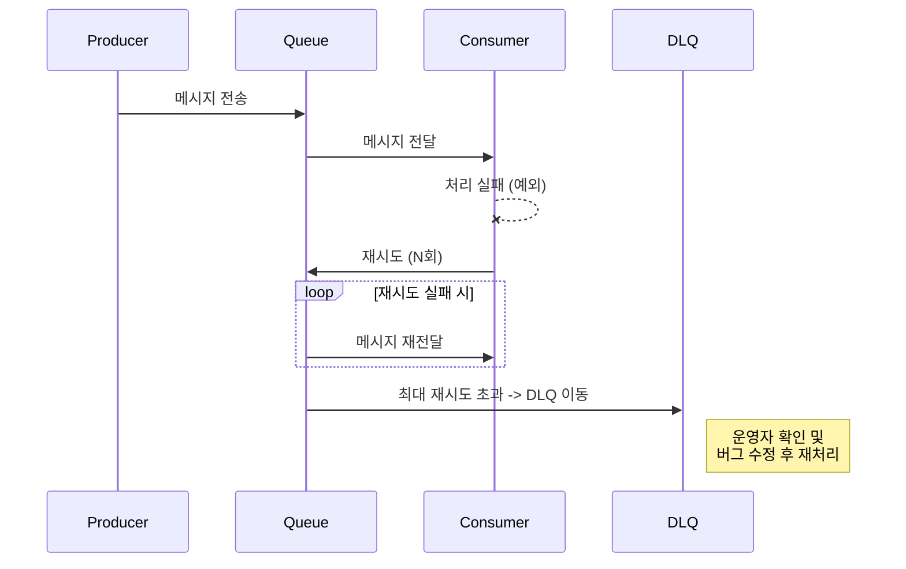

# 🏗️ 아키텍처 및 메시징 (Architecture & Messaging)

## 1. 메시지 큐와 이벤트 기반 아키텍처

### 1.1 주요 메시징 시스템 비교

| 특징 | Kafka | RabbitMQ | Redis Pub/Sub |
|------|-------|----------|---------------|
| **방식** | Pub/Sub (Log 기반) | Message Broker (Queue 기반) | Pub/Sub (In-memory) |
| **영속성** | 디스크 저장 (설정 기간 보관) | 메모리/디스크 (소비 후 삭제) | 저장 안 함 (휘발성) |
| **처리량** | 매우 높음 (대용량 배치) | 높음 | 매우 높음 |
| **용도** | 로그 수집, 스트리밍, 이벤트 소싱 | 복잡한 라우팅, 작업 큐 | 실시간 알림, 채팅 |

### 1.2 Kafka 구조 (Partition)
- **Topic**: 메시지를 구분하는 카테고리.
- **Partition**: 토픽을 분할하여 병렬 처리를 가능하게 하는 단위.
    - 파티션 내에서는 순서 보장.
    - 파티션 간에는 순서 보장 안 됨.
- **Consumer Group**: 하나의 토픽을 여러 컨슈머가 분담하여 처리.

---

## 2. 안정성을 위한 패턴

### 2.1 DLQ (Dead Letter Queue)
- **정의**: 정상적으로 처리되지 못한(실패한) 메시지를 별도로 보관하는 큐.
- **목적**:
    - 실패한 메시지로 인해 전체 처리가 막히는 것(Head-of-Line Blocking) 방지.
    - 실패 원인 분석 및 추후 재처리(Retry) 가능.
- **전략**:
    - 재시도 횟수(Retry Count) 초과 시 DLQ로 이동.
    - DLQ 모니터링 및 알림 설정 필수.



---

## 3. 비동기 처리 (Asynchronous Processing)

### 3.1 동기 vs 비동기
- **동기 (Synchronous)**: 요청 후 응답이 올 때까지 대기 (Blocking). 직관적이나 리소스 낭비 가능성.
- **비동기 (Asynchronous)**: 요청 후 응답을 기다리지 않고 다른 작업 수행 (Non-blocking). 리소스 효율 높음, 복잡도 증가.

### 3.2 Java/Spring 비동기 구현

#### @Async (Spring)
별도의 스레드에서 메서드를 실행하도록 지원하는 어노테이션.

```java
@Service
public class NotificationService {
    
    @Async("mailExecutor") // 별도 스레드 풀 사용
    public void sendEmail(String user, String message) {
        // 시간이 오래 걸리는 메일 발송 로직
    }
}
```

#### CompletableFuture (Java 8+)
비동기 작업의 결과 조작, 조합, 예외 처리를 위한 강력한 API.

```java
CompletableFuture.supplyAsync(() -> {
    return findUser(userId); // 비동기 실행
}).thenCompose(user -> {
    return getOrderHistory(user); // 결과 받아서 다음 비동기 작업 연결
}).exceptionally(ex -> {
    log.error("Error", ex); // 예외 처리
    return null;
});
```

### 3.3 Async Thread Pool
- **중요성**: 비동기 작업이 무제한으로 스레드를 생성하면 OOM 발생 가능. 반드시 적절한 사이즈의 스레드 풀을 정의해서 사용해야 함.
- **설정**: CorePoolSize, MaxPoolSize, QueueCapacity 등을 트래픽에 맞춰 튜닝.
