# 🛡️ 장애 대응 및 복원력 (Failure Management & Resilience)

## 1. 장애의 이해와 고가용성

### 1.1 장애(Failure) vs 오류(Error)

- **오류(Error)**: 시스템 내부에서 발생하는 예외 상황 (예: NullPointerException). 적절히 처리되면 서비스 중단으로 이어지지 않음.
- **장애(Failure)**: 시스템이 사용자에게 정상적인 서비스를 제공하지 못하는 상태. 오류가 누적되거나 처리되지 않아 발생.

### 1.2 SPOF (Single Point Of Failure)

- **정의**: 시스템 구성 요소 중 동작하지 않으면 전체 시스템이 중단되는 단일 지점.
- **예시**: 이중화되지 않은 DB, 단일 API 게이트웨이.
- **해결**: **고가용성(High Availability)** 아키텍처 구성 (이중화, 클러스터링).

### 1.3 고가용성 (High Availability, HA)

- **정의**: 서버, 네트워크, 프로그램 등의 정보 시스템이 상당히 오랜 기간 동안 지속적으로 정상 운영이 가능한 성질.
- **목표**: "99.999%" (Five Nines) 가용성 달성.

---

## 2. 핵심 지표 (Metrics)

### 2.1 MTTD & MTTR

장애 대응 효율성을 측정하는 핵심 지표입니다.

```mermaid
gantt
    dateFormat  HH:mm
    axisFormat  %H:%M
    title 장애 대응 타임라인

    section 장애 상황
    장애 발생       :crit, a1, 10:00, 2m
    장애 감지 (MTTD) :active, a2, after a1, 5m
    장애 복구 (MTTR) :a3, after a2, 15m
    정상화         :milestone, after a3, 0m
```



- **MTTD (Mean Time To Detect)**: 장애 발생 후 감지까지 걸리는 평균 시간. 모니터링 시스템의 성능을 나타냄.
- **MTTR (Mean Time To Recover)**: 장애 감지 후 복구까지 걸리는 평균 시간. 대응 프로세스와 복구 도구의 효율성을 나타냄.

### 2.2 SLA, SLO, SLI

- **SLA (Service Level Agreement)**: 서비스 제공자와 사용자 간의 공식적인 합의 (계약). 위반 시 페널티 존재.
- **SLO (Service Level Objective)**: SLA를 달성하기 위한 내부 목표치. (예: 월간 가용성 99.9%)
- **SLI (Service Level Indicator)**: 실제 측정되는 지표. (예: 성공한 요청 수 / 전체 요청 수)

---

## 3. 장애 예방 및 격리 패턴

### 3.1 서킷 브레이커 (Circuit Breaker)

외부 서비스 장애가 전파되는 것을 막기 위한 패턴입니다.

```mermaid
stateDiagram-v2
    [*] --> Closed
    Closed --> Open : 실패 임계치 초과
    Open --> HalfOpen : 일정 시간 경과
    HalfOpen --> Closed : 요청 성공
    HalfOpen --> Open : 요청 실패
    
    state Closed {
        note: 정상 상태\n요청 허용
    }
    state Open {
        note: 장애 상태\n요청 차단 (Fail Fast)
    }
    state HalfOpen {
        note: 테스트 상태\n일부 요청만 허용
    }
```

- **Closed**: 정상 상태. 모든 요청 통과.
- **Open**: 장애 감지. 요청 즉시 차단 및 대체 로직(Fallback) 수행.
- **Half-Open**: 복구 확인. 일부 요청을 보내 성공하면 Closed로 전환.

### 3.2 카오스 엔지니어링 (Chaos Engineering)

- **정의**: 운영 환경에서 예측 불가능한 장애를 견딜 수 있는지 확인하기 위해 **의도적으로 장애를 주입**하는 실험.
- **도구**: Chaos Monkey, AWS FIS.
- **목적**: 시스템의 약점을 미리 발견하고 복원력을 강화.

---

## 4. 사후 관리 (Postmortem)

### 4.1 장애 회고 (Postmortem)

장애 발생 후 원인을 분석하고 재발 방지 대책을 수립하는 문서화 과정입니다.

**필수 포함 요소:**

1. **타임라인**: 발생, 감지, 전파, 복구 시간 기록.
2. **영향 범위**: 영향을 받은 사용자 수, 손실된 트랜잭션 등.
3. **근본 원인 (Root Cause)**: '5 Whys' 기법 등을 사용하여 표면적 원인이 아닌 근본 원인 도출.
4. **Action Item**: 재발 방지를 위한 구체적인 할 일 (담당자, 기한 지정).
5. **Blameless Culture**: 개인을 비난하지 않고 프로세스와 시스템 개선에 집중.
