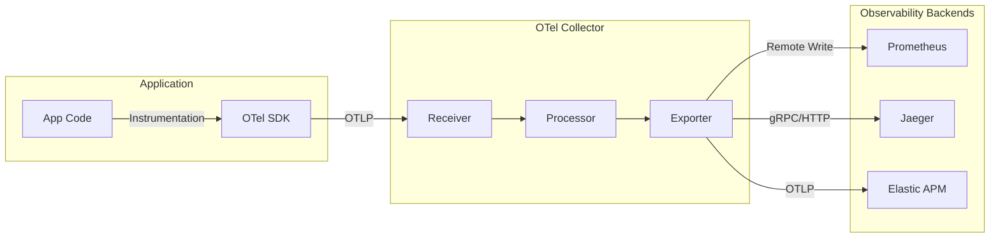

# 🔭 OpenTelemetry (OTel)

## 1. OpenTelemetry란?

### 1.1 정의
OpenTelemetry(OTel)는 클라우드 네이티브 소프트웨어의 관찰 가능성(Observability)을 위한 **벤더 중립적인 오픈소스 표준**입니다.
CNCF(Cloud Native Computing Foundation) 프로젝트 중 하나로, 이전에 분리되어 있던 **OpenTracing**과 **OpenCensus**가 통합되어 탄생했습니다.

### 1.2 핵심 역할
- **표준화**: 로그(Logs), 메트릭(Metrics), 트레이스(Traces) 데이터를 생성하고 수집하는 표준 방법을 정의합니다.
- **수집 및 전송**: 데이터를 생성(Instrument), 수집(Collect), 가공(Process), 내보내기(Export)하는 도구(SDK, API, Collector)를 제공합니다.
- **저장 및 분석은 하지 않음**: OTel은 데이터를 백엔드(Prometheus, Jaeger, Elastic APM, Datadog 등)로 전달하는 역할까지만 수행합니다.

---

## 2. OpenTelemetry 아키텍처



### 2.1 주요 구성 요소
1.  **API & SDK**: 언어별(Java, Python, Go, Node.js 등) 라이브러리. 애플리케이션 코드에서 데이터를 생성하는 데 사용됩니다.
    *   **Auto-Instrumentation**: 코드 수정 없이 에이전트만 붙여서 자동으로 데이터를 수집하는 기능도 강력합니다.
2.  **Collector**: 데이터를 수신, 처리, 내보내는 벤더 중립적인 프록시.
    *   **Receiver**: 데이터 수신 (OTLP, Jaeger, Prometheus 형식 등).
    *   **Processor**: 데이터 가공 (배치 처리, 재시도, 암호화, 필터링).
    *   **Exporter**: 백엔드로 데이터 전송 (Prometheus, Elastic, Datadog 등).
3.  **OTLP (OpenTelemetry Protocol)**: OTel 구성 요소 간 데이터 교환을 위한 범용 프로토콜.

---

## 3. 왜 OpenTelemetry인가? (장점)

1.  **벤더 종속성 탈피 (Vendor Neutrality)**:
    *   과거에는 Datadog을 쓰려면 Datadog Agent를, New Relic을 쓰려면 New Relic Agent를 심어야 했습니다.
    *   OTel을 쓰면 **애플리케이션 코드는 그대로 두고**, Collector 설정만 바꿔서 백엔드를 교체할 수 있습니다. (예: Jaeger -> Elastic APM)
2.  **표준화된 데이터 모델**:
    *   서로 다른 도구 간의 데이터 호환성 문제를 해결합니다.
3.  **풍부한 생태계**:
    *   거의 모든 주요 언어와 프레임워크, 클라우드 벤더가 OTel을 지원합니다.

---

## 4. 적용 예시 (Node.js)

```javascript
// tracing.js
const { NodeSDK } = require('@opentelemetry/sdk-node');
const { OTLPTraceExporter } = require('@opentelemetry/exporter-trace-otlp-http');
const { getNodeAutoInstrumentations } = require('@opentelemetry/auto-instrumentations-node');

const sdk = new NodeSDK({
  traceExporter: new OTLPTraceExporter({
    // OTel Collector 또는 백엔드 주소
    url: 'http://localhost:4318/v1/traces',
  }),
  instrumentations: [getNodeAutoInstrumentations()],
});

sdk.start();
```

애플리케이션 실행 시:
```bash
node --require ./tracing.js app.js
```
