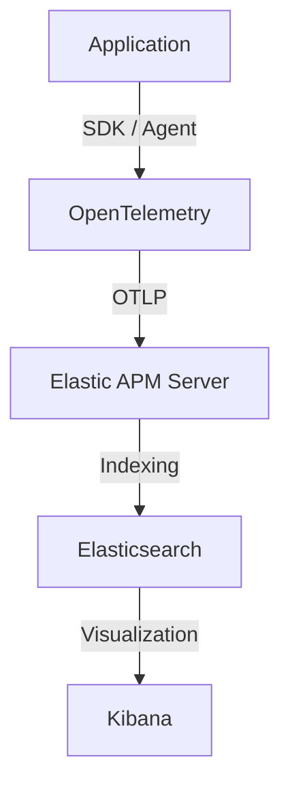
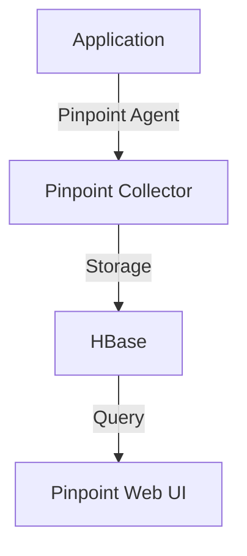

# 🆚 OpenTelemetry vs Elastic APM vs Pinpoint 비교

## 1. 한 문장 요약

> **OpenTelemetry는 ‘표준/수집 레이어’이고,**
> **Elastic APM과 Pinpoint는 ‘분석·저장·시각화 플랫폼’이다.**

---

## 2. 역할 기준 구분

### 📦 1️⃣ OpenTelemetry (OTel) — **표준 & 계측 레이어**
*   **목적**: “로그·메트릭·트레이스를 *어떻게 수집할 것인가*”
*   **정체성**: 👉 **벤더 중립 표준**
*   **하는 일**:
    *   SDK / Agent 제공
    *   Context propagation (문맥 전파)
    *   Trace / Metric / Log 생성
*   **하지 않는 일**:
    *   장기 저장
    *   UI (시각화)
    *   장애 분석 화면
*   **요약**: **데이터를 만들어서 전달하는 생산자(Producer)**

### 🔎 2️⃣ Elastic APM — **플랫폼 (수집 + 저장 + 분석 + UI)**
*   **목적**: “서비스 성능을 바로 보고, 원인을 분석한다”
*   **정체성**: 👉 **Elastic Stack에 강하게 결합된 APM 솔루션**
*   **하는 일**:
    *   APM Agent 제공
    *   Trace / Error / Transaction 분석
    *   Kibana UI 제공
    *   Logs / Metrics / Traces 통합 분석
*   **특징**:
    *   OpenTelemetry **수용 가능** (OTel 데이터를 받을 수 있음)
    *   자체 Agent도 보유
*   **요약**: **OTel을 입력으로 받을 수 있는 소비자(Consumer)**

### 🧠 3️⃣ Pinpoint — **APM 플랫폼 (특히 JVM 중심)**
*   **목적**: “대규모 분산 시스템의 호출 흐름을 정밀 분석”
*   **정체성**: 👉 **Java/JVM 특화 APM**
*   **하는 일**:
    *   Bytecode instrumentation (바이트코드 조작)
    *   Call graph 분석 (상세 호출 트리)
    *   TPS/Latency 중심 분석
*   **특징**:
    *   OpenTelemetry와 직접적 통합은 약함
    *   자체 에이전트/프로토콜 중심

---

## 3. 관계 도식화

### OpenTelemetry + Elastic APM 구조


### Pinpoint 구조


---

## 4. 핵심 비교 테이블

| 구분 | OpenTelemetry | Elastic APM | Pinpoint |
| :--- | :--- | :--- | :--- |
| **성격** | 표준 / 프레임워크 | APM 플랫폼 | APM 플랫폼 |
| **벤더 중립** | ✅ (Neutral) | ❌ (Elastic 종속) | ❌ (Pinpoint 종속) |
| **저장소** | ❌ (없음) | Elasticsearch | HBase |
| **UI 제공** | ❌ (없음) | ✅ (Kibana) | ✅ (Web UI) |
| **Node.js 친화** | ✅ (매우 좋음) | ✅✅ (매우 좋음) | ⚠️ (제한적) |
| **Java 특화** | 보통 | 보통 | ✅✅ (매우 강력) |
| **OTel 연계** | **본인 (표준)** | **수용자 (Receiver)** | 거의 없음 |

---

## 5. 실무에서의 선택 기준

### ✅ 이런 경우 → **OpenTelemetry + Elastic APM**
*   **멀티 언어 환경**: Node.js, Java, Go, Python 등이 섞여 있는 경우.
*   **벤더 종속 최소화**: 나중에 백엔드(저장소/UI)를 Datadog이나 Jaeger 등으로 교체할 가능성을 열어두고 싶을 때.
*   **Cloud Native**: Kubernetes 환경에서 표준적인 방법으로 관측성을 확보하고 싶을 때.

### ⚠️ 이런 경우 → **Pinpoint**
*   **JVM 비중 90% 이상**: Java/Kotlin 기반의 Spring 애플리케이션이 주력인 경우.
*   **상세 분석 필요**: 메서드 레벨의 정밀한 호출 분석과 Call Graph가 핵심인 경우.
*   **대규모 트래픽**: TPS가 매우 높고, 이미 Pinpoint 인프라(HBase 등) 운영 경험이 있는 경우.

---

## 6. 현실적인 권장 아키텍처 (Node.js 중심)

> **Node.js / NestJS / Kafka / K8s 환경이라면?**

```
App
 └─ OpenTelemetry SDK (Auto-Instrumentation)
       └─ OTLP
            └─ Elastic APM Server
                   └─ Elasticsearch + Kibana
```

이 구조가 **현재 업계에서 가장 무난하고 확장성 높은 선택**입니다.
OTel을 통해 표준을 준수하면서, Elastic Stack의 강력한 검색 및 시각화 기능을 활용할 수 있기 때문입니다.
