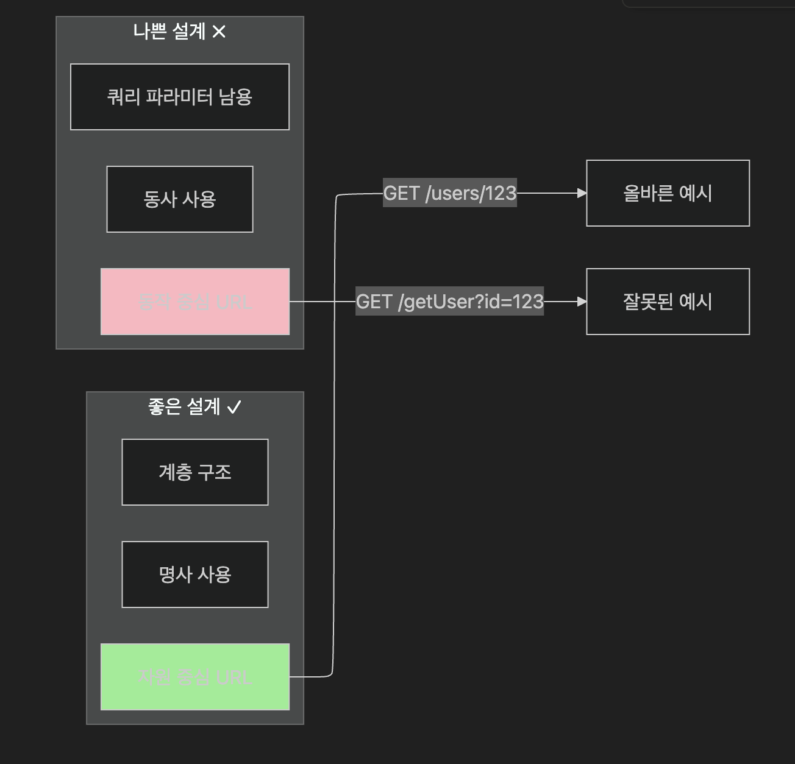

REST란 무엇인가요?
REST (Representational State Transfer)는 2000년 로이 필딩(Roy Fielding)이 박사 논문에서 제시한 웹 아키텍처 스타일입니다. 웹의 장점을 최대한 활용할 수 있는 아키텍처로, HTTP 프로토콜을 그대로 활용합니다.
REST의 6가지 핵심 원칙
REST 아키텍처 제약조건

Client-Server
클라이언트-서버

Stateless
무상태성

Cacheable
캐시 가능

Layered System
계층화 시스템

Uniform Interface
통합 인터페이스

Code on Demand
코드 온 디맨드 - 선택적

​
📚 참고: Roy Fielding의 박사 논문 "Architectural Styles and the Design of Network-based Software Architectures" (2000)
원문 보기
클라이언트-서버 구조
사용자 인터페이스와 데이터 저장 관심사를 분리
프론트엔드와 백엔드가 독립적으로 개발 가능
무상태성 (Stateless)
서버는 클라이언트의 상태를 저장하지 않음
각 요청은 독립적이며 완전한 정보를 포함해야 함
캐시 가능
응답에 캐시 가능 여부를 명시
성능 향상과 네트워크 트래픽 감소
계층화 시스템
중간 서버(프록시, 게이트웨이 등) 사용 가능
보안, 로드밸런싱 등의 기능 추가 가능
통합 인터페이스
모든 자원에 대해 일관된 인터페이스 제공
HTTP 메소드의 의미가 명확함
코드 온 디맨드 (선택)
서버가 클라이언트로 실행 가능한 코드 전송 가능
RESTful API 설계의 핵심
자원 (Resource) 중심 설계

HTTP 메소드와 CRUD 매핑
HTTP 메소드와 CRUD 매핑:
HTTP Method
CRUD Operation
설명
예시
GET
Read
자원 조회
GET /users/123
POST
Create
새 자원 생성
POST /users
PUT
Update
전체 수정
PUT /users/123
PATCH
Update
부분 수정
PATCH /users/123
DELETE
Delete
자원 삭제
DELETE /users/123
📚 참고: Martin Fowler의 Richardson Maturity Model
원문 보기
Level 0: The Swamp of POX
Level 1: Resources
Level 2: HTTP Verbs
Level 3: Hypermedia Controls
상태 코드 활용
200 OK: 성공
201 Created: 생성 성공
400 Bad Request: 잘못된 요청
404 Not Found: 자원 없음
500 Internal Server Error: 서버 오류
RESTful API 예시
1. 사용자 관리
GET    /api/users              # 모든 사용자 목록 조회
GET    /api/users/123          # 특정 사용자 조회
POST   /api/users              # 새 사용자 생성
PUT    /api/users/123          # 사용자 전체 정보 수정
PATCH  /api/users/123          # 사용자 일부 정보 수정
DELETE /api/users/123          # 사용자 삭제

​
2. 게시글 관리
GET    /api/posts              # 모든 게시글 목록
GET    /api/posts/456          # 특정 게시글 조회
POST   /api/posts              # 새 게시글 생성
PUT    /api/posts/456          # 게시글 수정
DELETE /api/posts/456          # 게시글 삭제

​
3. 댓글 관리 (중첩 자원)
GET    /api/posts/456/comments         # 특정 게시글의 댓글 목록
GET    /api/posts/456/comments/789     # 특정 댓글 조회
POST   /api/posts/456/comments         # 새 댓글 생성
PUT    /api/posts/456/comments/789     # 댓글 수정
DELETE /api/posts/456/comments/789     # 댓글 삭제

​
4. 할일 관리
GET    /api/todos              # 모든 할일 목록
GET    /api/todos?status=pending       # 상태별 필터링
POST   /api/todos              # 새 할일 생성
PATCH  /api/todos/123/complete # 할일 완료 처리
DELETE /api/todos/123          # 할일 삭제

​
5. 파일 관리
GET    /api/files              # 파일 목록
POST   /api/files              # 파일 업로드
GET    /api/files/abc123/download      # 파일 다운로드
DELETE /api/files/abc123       # 파일 삭제
